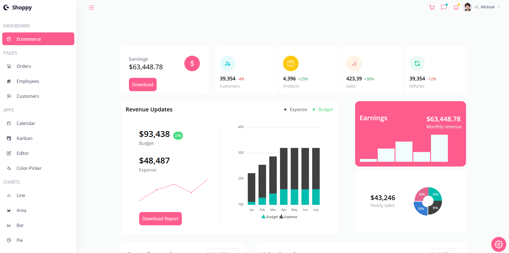
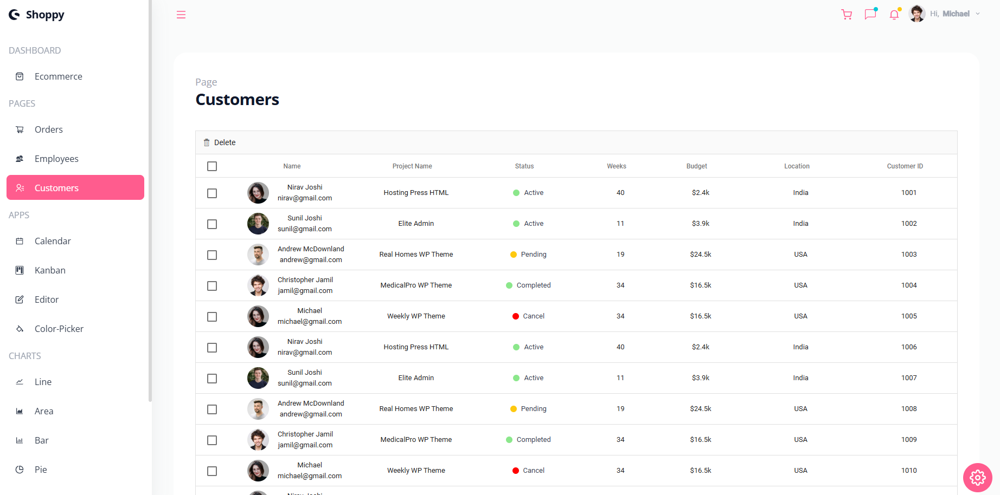
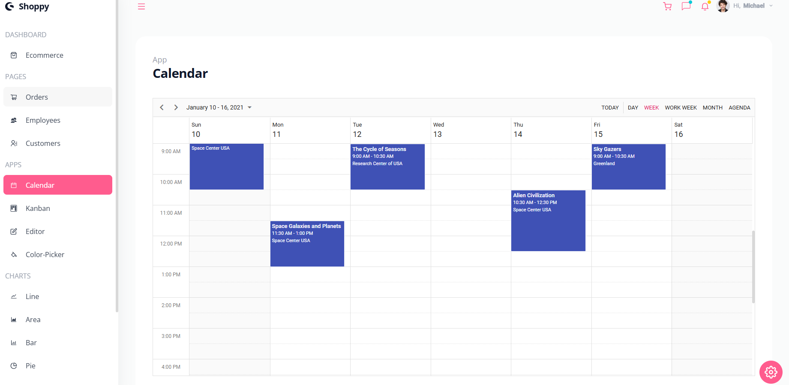
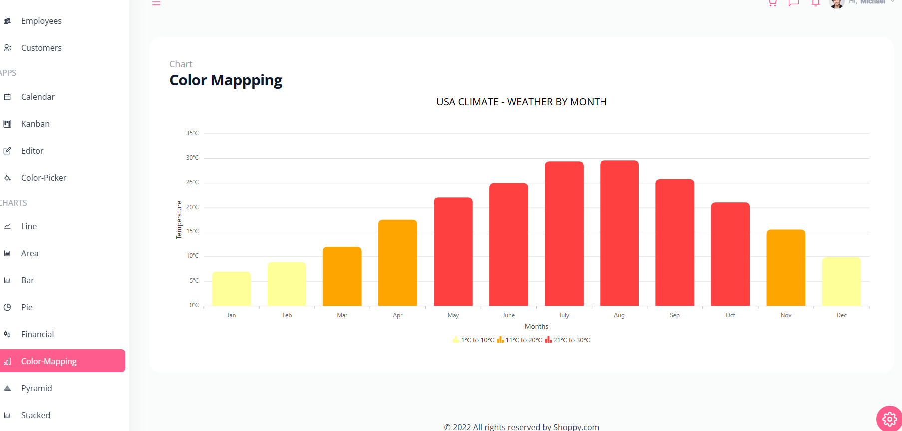

# Welcome to a React Admin Dashboard App With Theming, Tables, Charts, Calendar, Kanban and More


## 📋 <a name="table">Table of Contents</a>

1. 🤖 [Introduction](#introduction)
2. ⚙️ [Installation](#installation)
3. ⚙️ [Tech Stack](#tech-stack)
4. 🔋 [Features](#features)
5. 🔗 [Sample Images](#samples)

## <a name="Introduction">🤖 Introduction</a>

Welcome to the React Dashboard project! This project is a modern, responsive, and feature-rich dashboard application built using React, a popular JavaScript library for building user interfaces. The dashboard is designed to provide a comprehensive and intuitive user experience, making it ideal for various applications such as data visualization, management systems, and admin panels.

## <a name="Installation">🤖 Installation</a>

Follow these steps to set up the project locally on your machine.

**Prerequisites**

Make sure you have the following installed on your machine:

- [Git](https://git-scm.com/)
- [Node.js](https://nodejs.org/en)
- [npm](https://www.npmjs.com/) (Node Package Manager)

**Cloning the Repository**

```bash
git clone git@github.com:ilham-saleh/react-dashboard.git
cd react-dashboard
```

**Installation**

Install the project dependencies using npm:

```bash
npm install
```

**Run the app**

Run the app by using this command below

```bash
npm start
```

## <a name="tech-stack">⚙️ Tech Stack</a>

- React.js
- React Dropdowns
- React Schedule
- TailwindCSS
- Chart.js
- React Kanban
- And more...

## <a name="features">🔋 Features</a>

👉 **Profile**: Profile page shows important information about Tasks and Inbox

👉 **Earnings**: See your earnings and data regarding your products, customers, sales and refunds

👉 **Revenue Updates**: See charts that show your revenue updates. Filter them by Expense and Budget

👉 **Calendar**: Add or remove meetings or events on your Calendar

👉 **Kanban**: Add Todos and edit, remove as well as re-arrange them by dragging

👉 **Orders, Employees, Customers**: See your Orders, Employees, Customers lists and filter them by their activity. The list has pagination feature.

👉 **Charts**: There are different types of charts thet give a beauty to your dashboard. Fully interactive and animated.

👉 **Responsiveness**: Ensures the application adapts seamlessly to various screen sizes and devices, providing a consistent user experience across desktop, tablet, and mobile platforms.

## 📋 <a name="samples">Sample Images</a>






